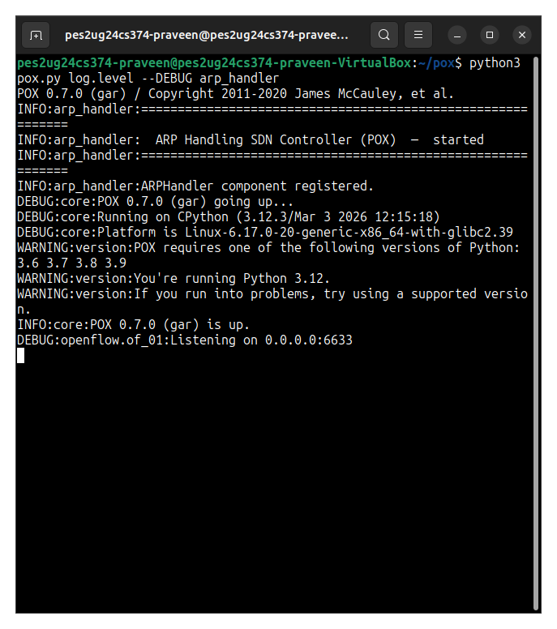
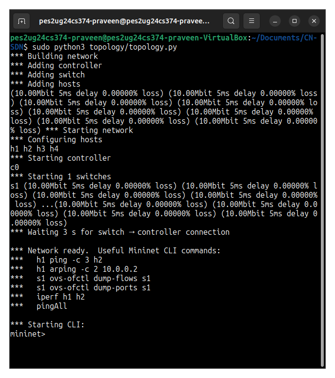
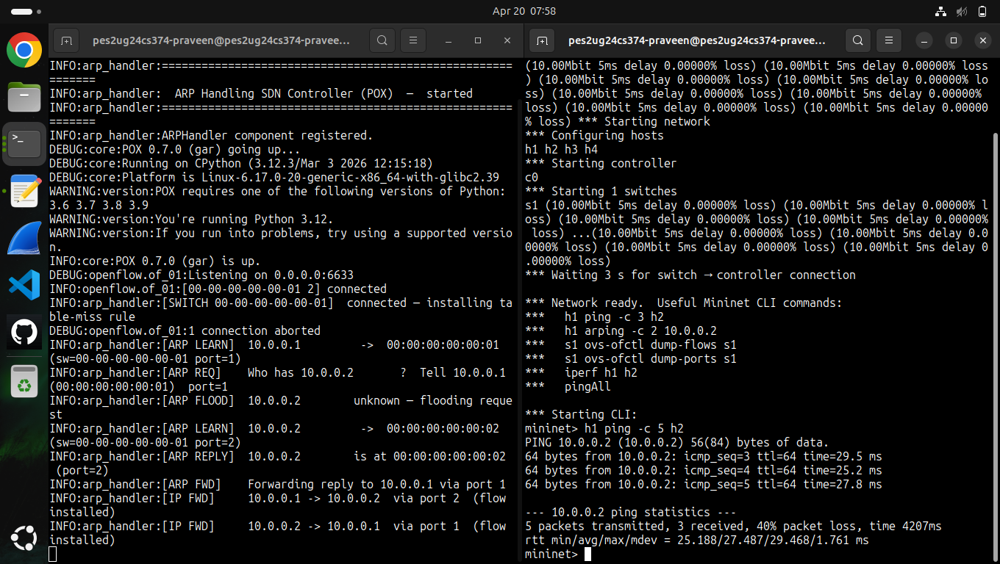
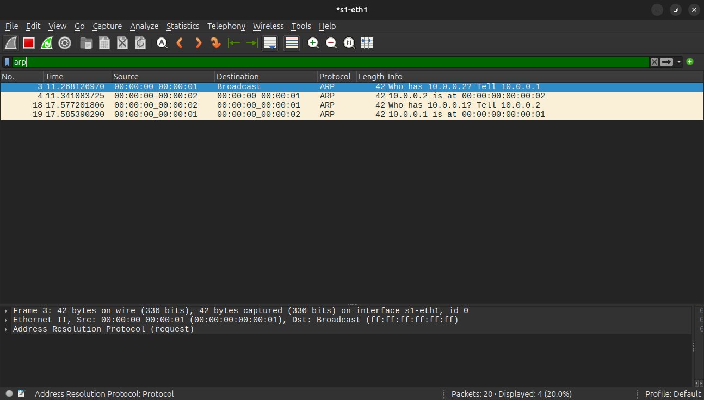
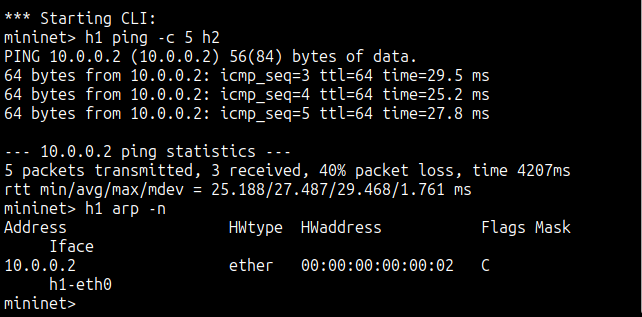
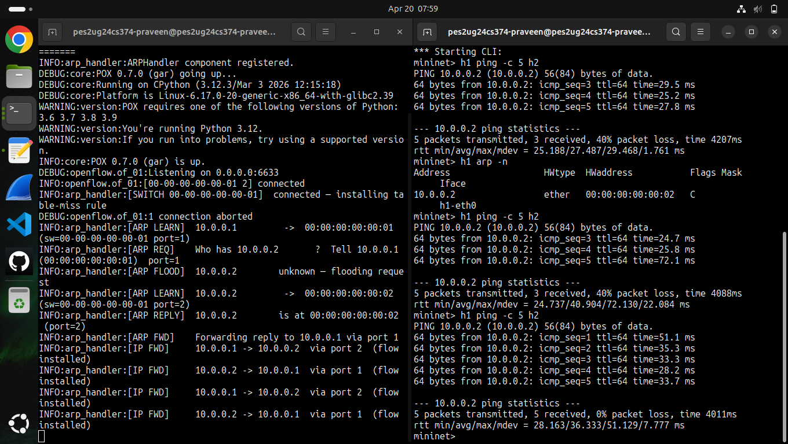
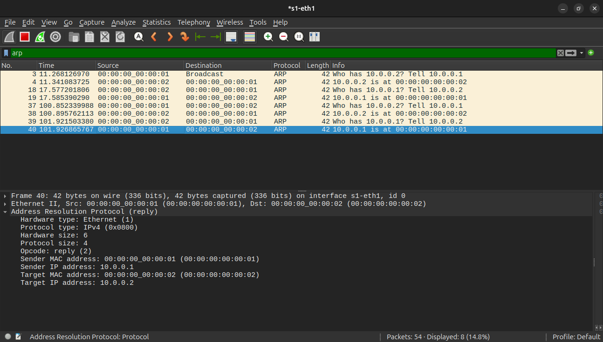

# ARP Handling in SDN Networks

A lightweight SDN-based ARP management system built using **POX** and **Mininet**,
featuring a centralised controller that intercepts, learns, and responds to ARP
packets — eliminating unnecessary broadcast floods through Proxy ARP.

This project is built entirely from scratch **without any high-level network
abstraction library** — it directly uses OpenFlow 1.0 primitives like `packet_in`
events, `ofp_flow_mod`, `ofp_packet_out`, and UNIX socket-based controller
communication to implement ARP interception, host discovery, and traffic forwarding.

---

## 📌 Overview

This project implements ARP handling in an SDN environment that allows the controller to:

- Intercept every ARP packet before the switch processes it
- Learn the IP → MAC → port mapping of every host automatically
- Answer ARP Requests directly from the controller (Proxy ARP) without flooding
- Forward ARP Replies to the correct host port
- Install proactive OpenFlow flow rules for IP traffic after ARP resolves

The system is split into two major components:

**POX Controller (`arp_handler.py`)** — A long-running SDN controller that handles
all ARP logic, builds an ARP table, generates synthetic ARP replies, and installs
flow rules into the switch.

**Mininet Topology (`topology.py`)** — A virtual network emulator that creates
4 hosts connected to a single OVS switch, with configurable link bandwidth and
delay, connected to the POX controller over OpenFlow 1.0.

These two components communicate via **OpenFlow 1.0** over TCP port **6633**.

---

## ⚙️ Requirements

| Requirement | Details |
|---|---|
| OS | Ubuntu 20.04 or Ubuntu 22.04 LTS (VM is fine) |
| Python | 3.6 – 3.12 (3.8 recommended for best POX compatibility) |
| Mininet | 2.3.0 or higher |
| Open vSwitch | 2.13 or higher |
| POX Controller | 0.7.0 (gar) |
| iperf | Version 2.x |
| Wireshark / tshark | Any recent version |

---
## ⬇️ Installing Dependencies

```bash
sudo apt update
sudo apt install -y \
    mininet \
    openvswitch-switch \
    iperf \
    wireshark \
    tshark \
    arping \
    git \
    python3 \
    python3-pip
```
- `mininet` — network emulator that creates virtual hosts, switches, and links
- `openvswitch-switch` — OpenFlow-capable virtual switch with `ovs-ofctl` tools
- `iperf` — TCP/UDP bandwidth measurement between hosts
- `wireshark` / `tshark` — packet capture and protocol analysis
- `arping` — sends raw ARP packets for targeted ARP testing
- `git` — needed to clone the POX controller repository

**Install the POX controller (not available via pip — must be cloned):**

```bash
git clone https://github.com/noxrepo/pox.git ~/pox
```

**Verify everything installed correctly:**

```bash
sudo mn --version
sudo ovs-vsctl --version
python3 --version
ls ~/pox/pox.py
iperf --version
which tshark
```
The above dependencies could be easily installed by simply running the <code>setup.sh</code> file attached within this repository

---

## 📁 Project Structure

```
CN-SDN/
├── controller/
│   └── arp_handler.py          # POX controller — all ARP + forwarding logic
├── topology/
│   └── topology.py             # Mininet topology builder + automated test runner
├── tests/
│   └── test_arp_handler.py     # 10 unit/regression tests (no Mininet needed)
├── requirements.txt            # Dependency list with install instructions
└── README.md                   # This file
```

### File Descriptions

**`controller/arp_handler.py`** — The heart of the SDN control plane. When loaded
by POX, it registers as a component and listens for OpenFlow events. It contains
the `ARPHandler` class with all ARP interception, Proxy ARP, host discovery, and
flow rule installation logic.

**`topology/topology.py`** — Mininet script that creates the 4-host single-switch
topology and connects it to the POX controller. Supports both an interactive CLI
mode and an automated `--test` mode that runs all scenarios and exits.

**`tests/test_arp_handler.py`** — 10 unit tests that verify ARP learning, Proxy
ARP behaviour, flood suppression, table snapshots, and switch connection setup.
Runs entirely without Mininet or POX installed using lightweight stubs.

---

## 🧠 Architecture

The system is designed around **two separate communication paths** — one for
OpenFlow control messages between the controller and switch, and one for data
traffic between hosts — to keep concerns cleanly separated.

```
Mininet CLI (user commands)
     │
     │  host traffic triggers packet_in
     ▼
OVS Switch (s1)                              ← OpenFlow 1.0 software switch
 ├── Flow Table (priority 0: table-miss → CONTROLLER)
 ├── Flow Table (priority 1: dl_dst=MAC → output:port)
 └── Ports: h1(1)  h2(2)  h3(3)  h4(4)
     │
     │  OpenFlow 1.0 over TCP port 6633
     ▼
POX Controller (arp_handler.py)              ← runs as: python3 pox.py log.level --DEBUG arp_handler
 ├── ARP Table  { IP → (MAC, dpid, port) }
 ├── MAC Table  { dpid → { MAC → port } }
 ├── _handle_ConnectionUp  → installs table-miss rule
 ├── _handle_PacketIn      → dispatches by EtherType
 ├── _handle_arp           → learn / proxy-reply / flood
 ├── _send_arp_reply       → crafts synthetic ARP Reply
 └── _handle_ipv4          → forward + install flow rule
```

### Why Proxy ARP instead of simple flooding?

**Simple flood (traditional):** Every ARP Request is broadcast to all hosts on
the network. All hosts receive and process it even if they are not the target.
Wastes bandwidth, scales poorly.

**Proxy ARP (this project):** The controller intercepts the ARP Request. If the
target IP is already in the ARP table, the controller crafts and sends an ARP
Reply directly — no broadcast ever reaches the network. This is visible in the
logs as `[ARP FLOOD]` on the first request and `[PROXY ARP]` on every
subsequent request for the same target.

---

## 🔄 System Working

### 1. Switch Connection

When Mininet starts and the OVS switch connects to the POX controller, the
`_handle_ConnectionUp` event fires:

- Installs a **table-miss rule** (priority 0, empty match) with action `OFPP_CONTROLLER`
- This ensures every packet with no matching flow rule is sent to the controller
- Initialises the MAC-to-port table for this switch datapath

```
[SWITCH 00-00-00-00-00-01]  connected — installing table-miss rule
```


### 2. ARP Request — First Time (Flood + Learn)

When h1 sends its first ARP Request asking "Who has 10.0.0.2?":

```
h1 ──ARP Request──► s1 ──packet_in──► POX Controller
                                            │
                                   [ARP LEARN] 10.0.0.1 → port 1
                                   10.0.0.2 not in table
                                   [ARP FLOOD] → OFPP_FLOOD
                                            │
                         s1 floods to h2, h3, h4 ◄──────────┘
                                            │
                    h2 sends ARP Reply ─────►s1 ──packet_in──► POX
                                                                 │
                                                      [ARP LEARN] 10.0.0.2 → port 2
                                                      [ARP FWD]  → output port 1
                                                                 │
                    h1 ◄──ARP Reply──────── s1 ◄──packet_out────┘
```


### 3. ARP Request — Repeat (Proxy ARP — No Flood)

When h1 sends another ARP Request for the same target:

```
h1 ──ARP Request──► s1 ──packet_in──► POX Controller
                                            │
                                   10.0.0.2 IS in ARP table
                                   [PROXY ARP] crafts ARP Reply
                                   target_mac = 00:00:00:00:00:02
                                            │
                    h1 ◄──ARP Reply──────── s1 ◄──packet_out────┘

No broadcast. No other host is involved.
```


### 4. IPv4 Forwarding + Flow Rule Installation

After ARP resolves and h1 sends an ICMP ping to h2:

- Controller receives the IP packet via `packet_in`
- Looks up `dst_mac` in the MAC table → finds port 2
- Installs a flow rule: `match dl_dst=00:00:00:00:00:02 → output:2`
- All subsequent packets to h2 are forwarded by the **switch hardware directly**
  without involving the controller at all

```
Flow rule installed:
  priority=1, idle_timeout=30s, hard_timeout=120s
  match:  dl_dst = 00:00:00:00:00:02
  action: output:2
```


### 5. Host Discovery

Every time the controller sees an ARP packet from a host, it records:

```python
arp_table[src_ip] = (src_mac, dpid, in_port)
```

This means after the first ping between any two hosts, both hosts are
permanently known to the controller. All future ARP Requests targeting
either host are answered instantly via Proxy ARP without any network traffic.

---

## 🛠️ Build / Setup Instructions

### Step 1 — Clone this project

```bash
git clone https://github.com/YOUR_USERNAME/CN-SDN.git ~/Documents/CN-SDN
cd ~/Documents/CN-SDN
```

### Step 2 — Install dependencies

```bash
sudo apt update
sudo apt install -y mininet openvswitch-switch iperf wireshark tshark arping git python3
git clone https://github.com/noxrepo/pox.git ~/pox
```

### Step 3 — Copy the controller into POX

```bash
cp ~/Documents/CN-SDN/controller/arp_handler.py ~/pox/arp_handler.py
```

Verify:

```bash
ls ~/pox/arp_handler.py
```

### Step 4 — Install Python test dependencies (optional)

```bash
pip3 install -r requirements.txt
```

### Step 5 — Verify everything is ready

```bash
sudo mn --version           # Mininet installed
sudo ovs-vsctl --version    # OVS installed
python3 --version           # Python available
ls ~/pox/pox.py             # POX exists
ls ~/pox/arp_handler.py     # Controller copied
```

---

## 🚀 Steps to Run

> **Always follow this order: clean → POX first → Mininet second**

### Before every session — clean leftover state

```bash
sudo mn -c
sudo fuser -k 6633/tcp 2>/dev/null
```

### Terminal 1 — Start the POX Controller

```bash
cd ~/pox
python3 pox.py log.level --DEBUG arp_handler
```

Wait until you see:

```
INFO:arp_handler:============================================================
INFO:arp_handler:  ARP Handling SDN Controller (POX)  —  started
INFO:arp_handler:============================================================
INFO:arp_handler:ARPHandler component registered.
INFO:core:POX 0.7.0 (gar) is up.
DEBUG:openflow.of_01:Listening on 0.0.0.0:6633
```

**Do not close Terminal 1.**

### Terminal 2 — Start the Mininet Topology

```bash
cd ~/Documents/CN-SDN
sudo python3 topology/topology.py
```

Wait for:

```
*** Network ready.
mininet>
```

Check Terminal 1 — you should now see:

```
INFO:openflow.of_01:[00-00-00-00-00-01 1] connected
INFO:arp_handler:[SWITCH 00-00-00-00-00-01]  connected — installing table-miss rule
```

### Terminal 3 (optional) — Watch flow table in real time

```bash
watch -n 1 sudo ovs-ofctl dump-flows s1
```

---

## 🖥️ CLI Commands

All commands are run from the `mininet>` prompt unless stated otherwise.

```bash
# First ping — triggers ARP flood and controller learning
mininet> h1 ping -c 5 h2

# Second ping — controller answers ARP directly (Proxy ARP, no flood)
mininet> h1 ping -c 5 h2

# Ping other pairs
mininet> h3 ping -c 5 h4
mininet> h1 ping -c 5 h4

# Full connectivity matrix (all 6 host pairs)
mininet> pingall

# View flow rules installed by the controller (run OUTSIDE Mininet)
sudo ovs-ofctl dump-flows s1

# Port statistics (packet and byte counts per port)
sudo ovs-ofctl dump-ports s1

# TCP throughput test
mininet> h1 iperf -s &
mininet> h2 iperf -c 10.0.0.1 -t 10

# UDP throughput test
mininet> h3 iperf -s -u &
mininet> h4 iperf -c 10.0.0.3 -u -b 5M -t 10

# Send raw ARP packets (useful with Wireshark)
mininet> h1 arping -c 4 10.0.0.2

# Show ARP cache on a host
mininet> h1 arp -n

# Exit Mininet
mininet> exit
sudo mn -c
```

### Wireshark capture commands

```bash
# Capture ARP packets on switch port 1 (h1's interface)
sudo tshark -i s1-eth1 -f "arp" -V

# Launch Wireshark GUI on switch port 2
sudo wireshark -i s1-eth2 &
```

Wireshark display filters:

```
arp                  — all ARP packets
arp.opcode == 1      — ARP Requests only
arp.opcode == 2      — ARP Replies only
icmp                 — ping traffic only
ip.src == 10.0.0.1   — traffic from h1 only
```

---

## 📸 Output Screenshots

### Screenshot 1



Caption: Screenshot showing start of POX controller


### Screenshot 2



Caption:  Screenshot showing building of topology (4 hosts, 1 controller) by mininet emulator


### Screenshot 3



Caption: Screenshot showing Host 1 initially sending an ARP request and receiving an ARP response with destination's MAC address after flooding done by the switch, the POX controller also displays how the arp table is updated using ARP LEARN and ARP REPLY


### Screenshot 4



Caption: Wireshark screenshot showing sending and receival of ARP requests and response respectively


### Screenshot 5



Caption: Screenshot showing updation of ARP table in switch after initial trying of pinging two hosts


### Screenshot 6



Caption: Screenshot showing working of proxy ARP reply sent to source host h1 directly from switch via information from ARP table instead of flooding


### Screenshot 7



Caption: Wireshark screenshot showing receival of proxy ARP reply directly from switch to source host h1


---


## 🎓 Conclusion

This project demonstrates ARP handling in an SDN environment using OpenFlow
primitives:

**Centralised ARP management** — instead of broadcasting ARP to every host,
the controller intercepts all ARP traffic and answers from its own table.
This eliminates flood traffic after the first host discovery and scales
better than traditional broadcast-based ARP.

**Packet-in event handling** — every ARP and unmatched IP packet is
processed in the controller's `_handle_PacketIn` method, which dispatches
by EtherType. This is the core pattern for all reactive SDN controllers.

**Match-action flow rule design** — after ARP resolves, a flow rule is
installed in the switch matching `dl_dst` (destination MAC) with action
`output:port`. The switch handles all subsequent packets without controller
involvement — this is the efficiency advantage of proactive flow installation.

**Host discovery** — the ARP table is built automatically from observed
traffic. No static configuration is needed. Any host that sends or receives
an ARP packet is immediately known to the controller.

Together, these mechanisms demonstrate the control plane / data plane
separation that is the defining characteristic of Software Defined Networking.

---

## 👨‍💻 Author

**Praveen Balaji P**

---

## 📌 Notes

- Always start **POX first**, then Mininet. POX must be listening on port 6633
  before the OVS switch tries to connect.
- Always run `sudo mn -c` before starting a new Mininet session to clean up
  any leftover virtual interfaces or processes from previous runs.
- The `arp_handler.py` file must be copied directly into `~/pox/` (not into
  a subdirectory). POX discovers components by looking in its own root
  directory. The launch command is `python3 pox.py log.level --DEBUG arp_handler`
  with **no** `ext.` prefix.
- `autoStaticArp=False` is set in `topology.py` intentionally. If this is
  set to `True`, Mininet pre-populates ARP tables and the controller never
  sees any ARP traffic — defeating the entire purpose of the project.
- The first ping between any two hosts will always lose 1–2 packets while
  ARP is being resolved. Use `ping -c 5` instead of `-c 3` to avoid
  misleading 66% loss statistics in screenshots.

---

## 📚 References


1. POX Controller Documentation — https://noxrepo.github.io/pox-doc/html/
2. POX GitHub Repository — https://github.com/noxrepo/pox
3. Mininet Official Walkthrough — http://mininet.org/walkthrough/
4. Open vSwitch Documentation — https://docs.openvswitch.org/en/latest/
